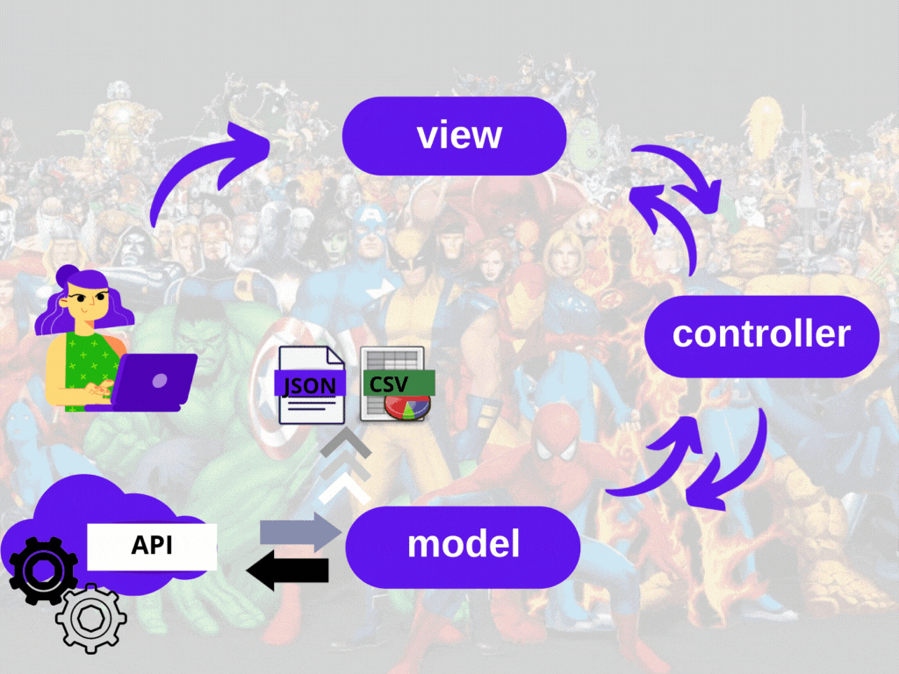

<p align="center">

</p>

# O projeto

O VamoAI é um projeto de formação de analista de dados, através de uma parceria do Ifood com a instituição de ensino Resilia.  

Ao final de cada módulo desenvolvemos um projeto. E para o fechamento do segundo módulo nós tivemos que desenvolver um software de requisição de API's, estruturado com o padrão MVC (Model-View-Controller). Em nosso algoritmo utilizamos o paradigma orientado a objetos e boas práticas de desenvolvimento de código, para a construção de um código limpo.

O software recebe duas flags e retorna os dados em dois formatos diferentes: JSON e CSV.

A API que escolhemos para trabalhar foi a disponibilizada pela [Marvel](https://developer.marvel.com/). Nela é possível obter dados sobre os heróis, as revistas em quadrinhos, os filmes, e muito mais sobre o universo fantástico da Marvel.


# Integrantes

<table width = 600px  align='center'>
<tr>
<td><b>Felipe Batista</b><br>
<a href="https://www.linkedin.com/in/felisouza/"><image src="./imagens/linkedIN.svg" width="25"/></a><a href = "https://www.linkedin.com/in/felisouza/"> in/felisouza </a>
<br>
<a href="https://github.com/Felisouza"><image src="./imagens/github-icon.svg" width="25"/></a><a href="https://github.com/Felisouza"> Felisouza</a>

<td><b>Jênnifer Stéfani</b>
<br>
<a href="https://www.linkedin.com/in/j%C3%AAnnifer-gama-908b9120a/"><image src="./imagens/linkedIN.svg" width="25"/></a><a href = "https://www.linkedin.com/in/j%C3%AAnnifer-gama-908b9120a/"> in/jêniffer-gama </a>
<br>
<a href="https://github.com/jenniferstefaniks"><image src="./imagens/github-icon.svg" width="25"/></a><a href="https://github.com/jenniferstefaniks"> jenniferstefaniks</a>

<td><b>Michelle Lira</b>
<br>
<a href="https://www.linkedin.com/in/lira-michelle/"><image src="./imagens/linkedIN.svg" width="25"/></a><a href = "https://www.linkedin.com/in/lira-michelle/"> in/lira-michelle </a>
<br>
<a href="https://github.com/michelle-lira"><image src="./imagens/github-icon.svg" width="25"/></a><a href="https://github.com/michelle-lira"> michelle-lira</a>
</td>
</table>


<table align='center'>
<td><b>Natalia Gomes </b>
<br>
<a href="https://www.linkedin.com/in/natalia-gomes-4542781b1"><image src="./imagens/linkedIN.svg" width="25"/></a><a href = "https://www.linkedin.com/in/natalia-gomes-4542781b1"> in/natalia-gomes</a>
<br>
<a href="https://github.com/Natalia-oli"><image src="./imagens/github-icon.svg" width="25"/></a><a href="https://github.com/Natalia-oli"> Natalia-oli</a>

<td><b>Thiago Silva</b>
<br>
<a href="https://www.linkedin.com/in/thiagosilvafarias/"><image src="./imagens/linkedIN.svg" width="25"/></a><a href = "https://www.linkedin.com/in/thiagosilvafarias/"> in/thiagosilvafarias</a>
<br>
<a href="https://github.com/tsffarias"><image src="./imagens/github-icon.svg" width="25"/></a><a href="https://github.com/tsffarias"> tsffarias</a>
	</table>
	<br>

# Estrutura do nosso projeto

Para obter os dados da API Marvel o usuário entrará em contato com a View do nosso software. A View exibirá na tela duas perguntas:

```
"Digite a palavra referente ao formato escolhido: "
"Informe a quantidade de herois desejada: "
```
A partir das escolhas do usuário a View chamará funções do Controller que, por sua vez, fará a ponte com o Model.

É no Model onde são feitas as requisições para a API da Marvel. É nele que a chave de acesso é construída, através de bibliotecas e funções, para que consigamos puxar os dados em formato JSON. Na Model, também, que ocorre a formatação do arquivo para ser mostrado ao usuário.

O Controller pega o arquivo feito pela Model, com as informações que o usuário deseja (quantidade e formato), e manda novamente para a View. Ela, a View, por sua vez formata o arquivo em uma lista e mostra para o usuário na tela o nome do herói, a descrição dele e quais as revistas em quadrinhos e séries ele aparece.

Segue abaixo um modelo visual de como funciona nosso software.

<p align="center">

<p>

